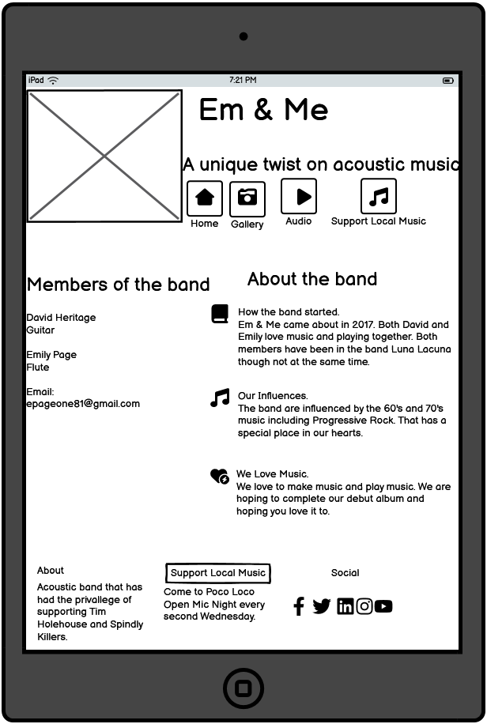

# Em & Me Band Website

## Description

The purpose of this site is to provide prospective fans and music fans to have a look at what we do and what we can offer to our local music commuity.

I wanted to create this website as I am a huge music fan and and musician and wanted to create my own bands website.

I built this website in order to showcase what I have learned so far through my Level 5 Diploma in Web Development through the [Code Institute] (<https://codeinstitute.net>)

Troughout this project so far I have grown in confidence using HTML and CSS and feel that I can code to a certain point and create a website that hopefully is user-friendly, something I previously could not but that is why I wanted to do this course.

From studying the course material and other resources on the web, I have learned lots of different ways to get the ideas dfrom my head in to the code of my website. It's been a a huge learning curve and not as easy as I originally thought.

## UX Design

### Project Goals

My goals were to make this website visually user-friendly and easy to use for the user. It would give the user a chance to hear and see one of our live gigs and hear one of our demo tracks. Also to make it established on all three devices such as mobile phone, tablet and full web page.
I used wireframes to sketch out a rough idea of how these would look on all three devices. This included all four pageson each device and all of its sections that were shown on a mobile device.

### Wireframes

